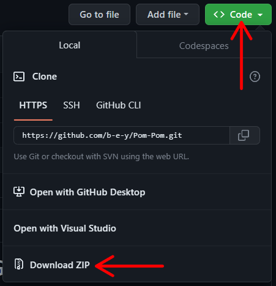

# Honkai: Star Rail Simple Game Cheat

This repository provides code for a simple cheat for the game Honkai Star Rail. For informational purposes only. **Use at your own risk.**

### Join the [Discord Server](https://discord.gg/vC9a8ba4b8) for early releases and updates! 

	

## Features & Hotkeys

#### General
- Protection Bypass (Anti cheat bypass)
- Hotkeys
- Notifications

#### Player
- Speed Hack (Dialog/Scene/World Speed)
- Invisibility

#### World
- Auto Dialog
- Auto Battle Unlock
- Blind Enemies (Enemy No Aggro)

#### Visuals 
- Peeking
- FPS Unlock

#### Hotkeys
- F1: Open/Close menu
- F2: Toggle World Speed
- F3: Toggle Battle Speed
- F4: Toggle Auto-Dialogue (CAPSLOCK if not automatically detected)
- F5: Toggle Invisibility
- F6: Toggle Force Auto-Battle
- F7: Toggle Peeking

## Instructions

Step 1: Download the code

Step 2: Unzip the archive.

Step 3: Compile code.

Step 4: Select StarRail.exe.

Step 5: Done!

